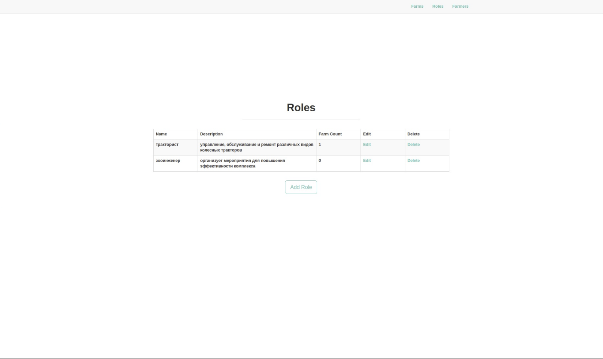
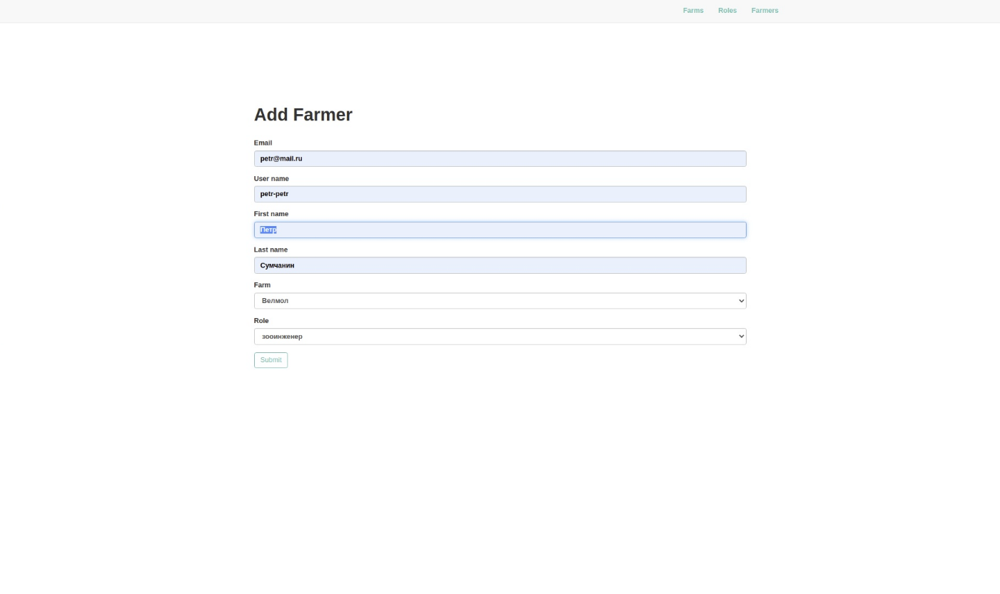

# Simple CRUD app with Flask and Postgresql
A small application implements access to the database through a graphical interface.

# Try it!
First of all, you need to create an empty database where all our models will be stored.
```sql
CREATE DATABASE cruddb;
```

Then change ./instance/config. Insert the <user_name> and <password> of the user who has access rights to database cruddb.
```python
# ./instance/config
SQLALCHEMY_DATABASE_URI = 'postgres://<user_name>:<password>@localhost:5432/cruddb'
SECRET_KEY = 'secret'
```
Make migrations.
```shell
flask db init
flask db migrate
flask db upgrade
```


Create new venv and install requirements.
```shell
python3 -m venv env
. env/bin/activate
pip install -r requirements.txt
```

You can set the app configuration by changing FLASK_CONFIG in setenv.sh. And finally launch the application. Follow http://127.0.0.1:5000/crud_app/rules.

```shell
. ./setenv.sh
```

